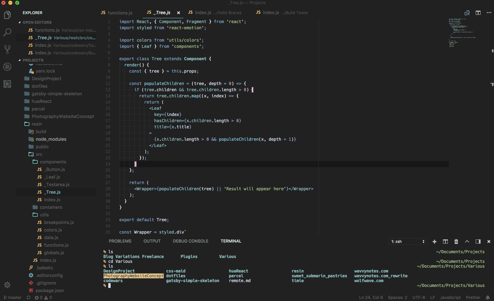

  
<h2 align="center">
VS Nord Theme
</h2>

  <h3> A darker approach for the awesome <a target='_blank' href='https://github.com/arcticicestudio/nord-visual-studio-code'>Nord theme</a> For Visual Studio Code </h3>

### Screenshot

